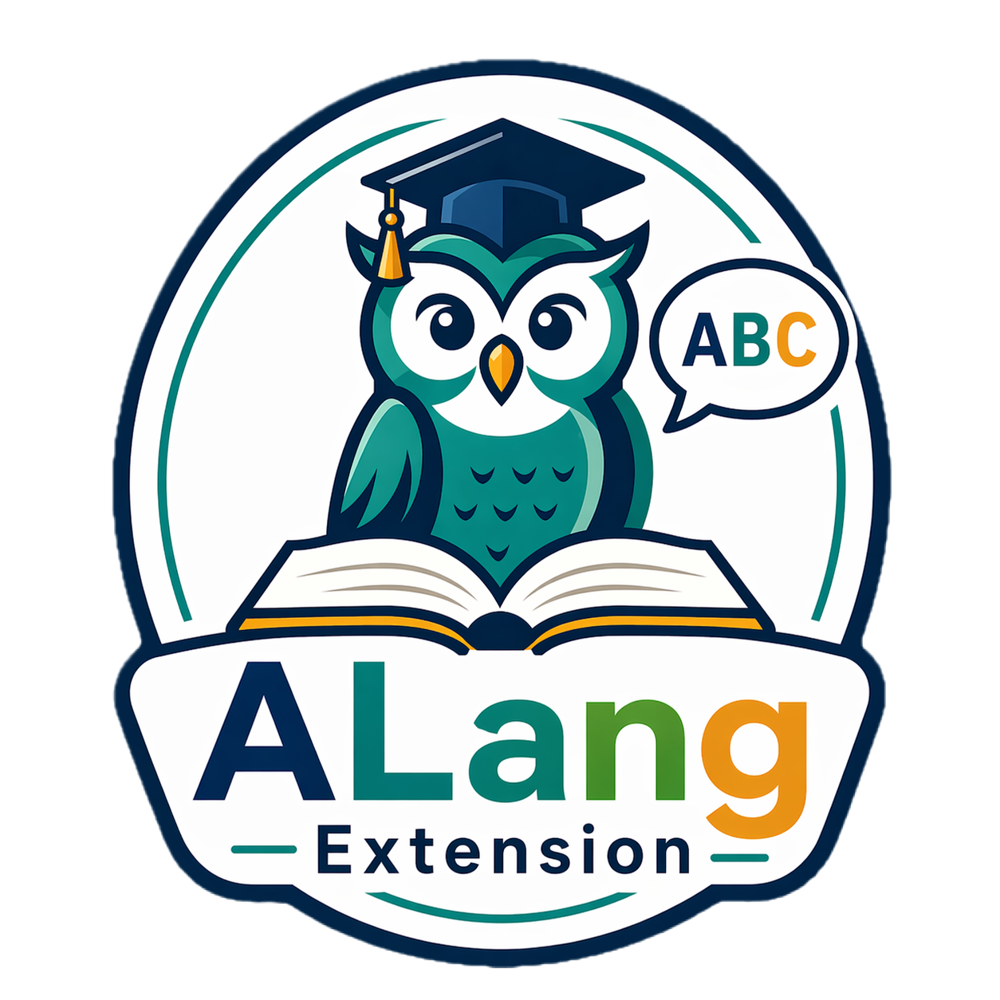

<div align="center">



# ALang Extension

### Read web pages in multiple languages, translate in context, listen to pronunciation, and save vocabulary.

[](https://developer.chrome.com/docs/extensions/)
[](https://developer.chrome.com/docs/extensions/develop/migrate/what-is-mv3)
[](https://developer.mozilla.org/en-US/docs/Web/JavaScript)
[](./manifest.json)

</div>

## Overview

ALang Extension is a Chrome extension for assisted reading on regular web pages. Enable it only when needed, click words or select short phrases, get quick inline translations, listen to pronunciation, and save useful vocabulary for later review.

This project was built through a **Vibe Code** workflow and refined with **Codex**.

## Table of Contents

- [Features](#features)
- [Tech Stack](#tech-stack)
- [How It Works](#how-it-works)
- [Getting Started](#getting-started)
- [Usage](#usage)
- [Keyboard Shortcuts](#keyboard-shortcuts)
- [Project Structure](#project-structure)
- [Supported Languages](#supported-languages)
- [Notes](#notes)

## Features

- **Manual tab activation**: enable the extension only on the current tab.
- **Inline translation**: click a word and see its translation directly on the page.
- **Phrase selection**: select words or short phrases and translate them with the same annotation flow.
- **Phrase expansion**: click nearby words to expand the current phrase and retranslate it.
- **Saved vocabulary**: store words and phrases with translation, context, page title, and URL.
- **Vocabulary review**: search, review, delete, and export saved items from the popup.
- **JSON and CSV export**: download saved vocabulary for backup or external study tools.
- **Text-to-speech**: listen to selected words or phrases with browser `speechSynthesis`.
- **Voice settings**: choose voice source, voice name, speed, and pitch.
- **Language settings**: configure source and target languages from the popup or options page.
- **Visual customization**: choose translation and highlight colors.
- **Context menu save**: save selected page text through the Chrome context menu.

## Tech Stack

| Technology | Purpose |
| --- | --- |
| Chrome Extension MV3 | Browser extension platform |
| JavaScript | Extension logic, DOM annotation, popup, and options |
| HTML | Popup and options page markup |
| CSS | Popup, options, and inline annotation styling |
| Chrome Storage API | Local vocabulary and settings storage |
| Chrome Context Menus API | Save selected text from the page menu |
| Web Speech API | Text-to-speech playback |
| Google Translate endpoint | Quick translation requests |

## How It Works

ALang Extension runs entirely in the browser:

- `content.js` injects the reading and annotation experience into pages.
- `content.css` styles inline translations, highlights, and annotation actions.
- `background.js` handles translation requests, storage access, context menus, and runtime messages.
- `popup.html` and `popup.js` provide activation, language controls, vocabulary review, and export.
- `options.html` and `options.js` provide deeper language and audio settings.
- Chrome storage keeps saved vocabulary and settings locally in the browser.

No backend server is required for the core reading experience.

## Getting Started

### Prerequisites

- Google Chrome or a Chromium-based browser.
- Developer mode enabled on the extensions page.

### Load In Chrome

1. Open `chrome://extensions/`.
2. Enable `Developer mode`.
3. Click `Load unpacked`.
4. Select this project folder.
5. Pin **ALang Extension** from the Chrome extensions menu if desired.

### Reload After Changes

After editing extension files:

1. Open `chrome://extensions/`.
2. Find **ALang Extension**.
3. Click the reload button.
4. Refresh any web page where the extension is active.

## Usage

1. Open a page in one of the supported source languages.
2. Open the extension popup and click `Enable on this tab`.
3. Click a word or select a text segment.
4. Review the inline translation above the annotated word or phrase.
5. Click nearby words to merge them into the phrase and update the translation.
6. Use `Save`, `Listen`, or `Clear all` from the inline annotation.
7. Open the popup to review, search, delete, or export saved vocabulary.

## Keyboard Shortcuts

- `Alt + S`: save the current annotation.
- `Alt + P`: play audio for the current annotation.
- `Esc`: clear the current inline annotation.

## Project Structure

```text
.
|-- assets/
|   |-- icons/
|   |   |-- icon-16.png
|   |   |-- icon-32.png
|   |   |-- icon-48.png
|   |   |-- icon-128.png
|   |   `-- icon-256.png
|   `-- source/
|       |-- alang-extension-icon-master.png
|       |-- alang-extension-logo.png
|       `-- alang-logo-transparent.png
|-- background.js
|-- content.css
|-- content.js
|-- manifest.json
|-- options.css
|-- options.html
|-- options.js
|-- popup.css
|-- popup.html
`-- popup.js
```

## Supported Languages

- English
- Mandarin Chinese
- Hindi
- Spanish
- Arabic
- Portuguese
- Japanese
- French
- Italian

## Notes

- Vocabulary and settings are stored locally in Chrome storage.
- Clearing browser extension data may remove saved vocabulary and settings.
- Translation quality and availability depend on the external Google Translate endpoint.
- Text-to-speech voices depend on the browser and operating system.
- Activation is per browser tab and per browser session.
- To avoid breaking navigation, inline clicks ignore links, form fields, and interactive elements.
- The current target platform is Chrome/Chromium with Manifest V3.
